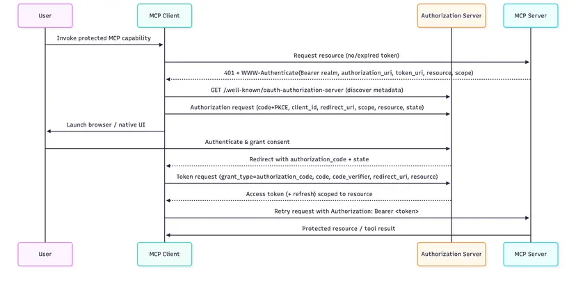

# OAuth 2.1

OAuth 2.1 is the standard authorization framework adopted by the MCP specification to secure communication between MCP clients and servers. It allows clients to obtain limited access to server resources on behalf of a user, without sharing credentials directly. For a comprehensive introduction to how OAuth works in MCP, see the [MCPJam OAuth Guide](https://www.mcpjam.com/blog/mcp-oauth-guide).



MCPConnect acts as an OAuth 2.1 **resource server** — it does **not** implement an authorization server. Authentication is delegated to an external provider (e.g. Microsoft Entra ID, Auth0, Keycloak, Okta, or any OpenID Connect provider).

::: info
MCPConnect currently supports only the **Preregistration (Client Credential)** mode, where the MCP client is pre-registered with the authorization server and uses its own credentials to obtain an access token.
:::

## The IOAuthConfig Plugin

OAuth is configured through the `IOAuthConfig` plugin:

```pascal
uses
  MCPConnect.Configuration.Auth,
  MCPConnect.Security.Token;

AServer
  .Plugin.Configure<IOAuthConfig>
    .SetResource('https://mcp.example.com/mcp')
    .AddAuthorizationServer('https://auth.example.com')
    .AddTrustedIssuer('https://auth.example.com/')
    .SetTokenValidatorClass(TJoseTokenValidator)
    .AddScopesSupported('openid')
    .AddScopesSupported('email')
    .AddScopesSupported('profile')
  .ApplyConfig;
```

If no authorization server is configured, OAuth enforcement is fully disabled and every request is allowed through.

## Configuration

The configuration values (resource URL, authorization server, token issuer) are typically read from environment variables or a `.env` file, as shown in the `MCPServerOAuth` demo:

```pascal
AServer
  .Plugin.Configure<IOAuthConfig>
    .SetResource(TEnvironment.Get('OIDC_MCP_SERVER'))
    .AddAuthorizationServer(TEnvironment.Get('OIDC_AUTH_SERVER'))
    .AddTrustedIssuer(TEnvironment.Get('OIDC_TOKEN_ISSUER'))
    {$IFDEF DELPHI_JOSE_JWT}
    .SetTokenValidatorClass(TJoseTokenValidator)
    {$ELSE}
    .SetTokenValidatorClass(TClaimsTokenValidator)
    {$ENDIF}
    .AddScopesSupported('openid')
    .AddScopesSupported('email')
    .AddScopesSupported('profile')
  .ApplyConfig;
```

## IOAuthConfig API Reference

| Method | Description |
|--------|-------------|
| `SetResource(url)` | The canonical, public URL of this MCP server. **Must be called first** — other methods derive URLs from it. |
| `SetRealm(realm)` | The `realm` value sent in the `WWW-Authenticate` header. Defaults to `'mcp'`. |
| `AddAuthorizationServer(url)` | Registers an external authorization server. Can be called multiple times. |
| `AddTrustedIssuer(url)` | Adds a trusted token issuer. Useful when the token's `iss` differs from the discovery URL (e.g. Entra ID v1.0 tokens). |
| `AddScopesSupported(scope)` | Advertises a supported OAuth scope. Can be called multiple times. |
| `SetTokenValidatorClass(class)` | Registers the class that validates bearer tokens. Without it, every bearer token is rejected. |
| `SetAudience(audience)` | Value the token's `aud` claim must contain. Defaults to `SetResource`. |
| `AddRequiredScope(scope)` | Scope the token must carry, else `insufficient_scope`. Can be called multiple times. |
| `SetClockSkew(seconds)` | Tolerance on `exp`/`nbf` claims, in seconds. Defaults to 60. |
| `SetKeyCacheTTL(seconds)` | Lifetime of the cached JWKS, in seconds. Defaults to 3600. |
| `EnableMetadataProxy(issuer)` | Proxies the authorization server's discovery document, patching missing `code_challenge_methods_supported`. See the [MCPConnect oauth documentation](https://github.com/delphi-blocks/MCPConnect/blob/master/Docs/oauth.md#4-the-metadata-proxy) for details. |

## Token Validators

MCPConnect ships three token validators:

| Validator | Unit | What it checks | Use case |
|-----------|------|----------------|----------|
| `TJoseTokenValidator` | `MCPConnect.Security.Token.JOSE` | Everything including the **cryptographic signature**, verified against the provider's published JWKS keys | **Production** |
| `TClaimsTokenValidator` | `MCPConnect.Security.Token` | `iss`, `aud`, `exp`/`nbf`, required scopes, rejects `"alg": "none"`, verifies `kid` exists in JWKS — but **does not verify the signature** | Testing with a real provider |
| `TDecodeOnlyTokenValidator` | `MCPConnect.Security.Token` | Decodes the payload and verifies nothing | **Local development only** |

`TJoseTokenValidator` requires the [JOSE-JWT library](https://github.com/paolo-rossi/delphi-jose-jwt) at compile time (controlled by the `DELPHI_JOSE_JWT` define in `MCPConnect.inc`) and the OpenSSL libraries at runtime.

## Reading the Token in a Tool

Once a request is authenticated, the validated claims are available via `[Context]` injection as `TMCPAccessToken`:

```pascal
TTestTool = class
private
  [Context]
  FToken: TMCPAccessToken;
public
  [McpTool('get-user', 'Get the current user information')]
  function GetUser: TUser;
end;

function TTestTool.GetUser: TUser;
begin
  Result := TUser.Create;
  Result.Name := FToken.Name;
  Result.EMail := FToken.EMail;
  Result.Subject := FToken.Subject;
end;
```

`TMCPAccessToken` exposes standard claims (`Subject`, `Name`, `EMail`, `Scope`, `Issuer`, `Audience`, `Expiration`, etc.) and the raw JWT payload via the `Payload` property for direct access to any non-wrapped claim.

## Further Reading

For detailed instructions on configuring and testing OAuth with external providers (including a step-by-step guide with Microsoft Entra ID, Cloudflare Tunnel, and MCPJam Inspector), see the [OAuth documentation in the MCPConnect repository](https://github.com/delphi-blocks/MCPConnect/blob/main/Docs/oauth.md).
