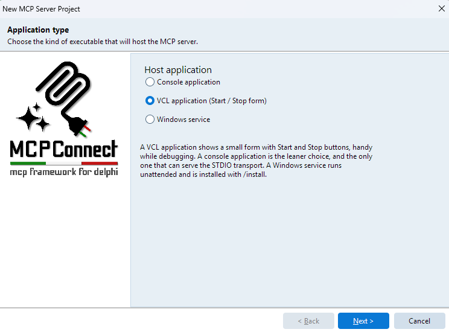

# Server Setup

This guide explains how to create an MCP server with MCPConnect, covering the available transport options and their trade-offs.

## Using the IDE Wizard

The quickest way to create a new MCP server project is through the Delphi IDE wizard. Go to **File → New → Other → MCPConnect** to launch the project wizard, which generates a ready-to-run server with the transport and configuration of your choice.



## MCP Transport Types

The MCP specification defines two transport mechanisms:

| Transport | Description |
|-----------|-------------|
| **Standard I/O (stdio)** | Server communicates via standard input/output streams. The MCP client launches the server process and exchanges JSON-RPC messages through stdin/stdout. |
| **Streamable HTTP** | Server exposes an HTTP endpoint. The MCP client connects over the network and communicates via HTTP requests. |

The right choice depends on your deployment scenario:

- Use **stdio** when the MCP client manages the server lifecycle directly (e.g., Claude Desktop, local integrations).
- Use **Streamable HTTP** when the server must be accessible over a network or must serve multiple clients concurrently.

## Stdio Transport

A stdio server is a console application. The MCP client process spawns it, then communicates through its stdin/stdout pipes. This is the simplest transport and requires no network configuration.

**Create a Console Application** (`{$APPTYPE CONSOLE}`) and add `MCPConnect.Transport.Stdio` to the uses clause.

```pascal
uses
  System.SysUtils,
  MCPConnect.JRPC.Server,
  MCPConnect.MCP.Server.Api,
  MCPConnect.Transport.Stdio,
  MCPConnect.Configuration.MCP,
  MCPConnect.Content.Writers.RTL,
  MyApp.Tools;   // Unit with your MCP tool classes

procedure StartServer;
var
  LServer: TJRPCStdioServer;
begin
  LServer := TJRPCStdioServer.Create(nil);
  try
    // Register tools, resources, prompts, sessions, authentication, etc.
    // See the Plugin System chapter for details
    //
    // LServer.JRPCServer
    //   .Plugin.Configure<IMCPConfig>
    //     .Tools
    //       .RegisterClass(TMyTool)
    //     .BackToMCP;

    LServer.StartServerAndWait;
  finally
    LServer.Free;
  end;
end;

begin
  try
    StartServer;
  except
    on E: Exception do
      Writeln(ErrOutput, E.ClassName, ': ', E.Message);
  end;
end.
```

`StartServerAndWait` blocks until the client closes the connection, making it the typical entry point for stdio servers.

As an alternative, you can manage the loop manually using `StartServer` and `ProcessRequests`. This is useful when you need to interleave MCP request processing with other work (logging, watchdog pings, periodic tasks, etc.):

```pascal
LServer.StartServer;
while not LServer.Terminated do
begin
  LServer.ProcessRequests;
  Sleep(1000);
end;
```

`ProcessRequests` handles any pending incoming messages and returns immediately, while `Terminated` becomes `True` when the client closes the connection.

::: warning
Never write to stdout in a stdio server — it corrupts the JSON-RPC stream. Use `ErrOutput` or a Logify file adapter for diagnostics.
:::

**Pros:**
- Zero network configuration — no ports, firewalls, or TLS to manage.
- Simple lifecycle — the client controls when the server starts and stops.
- Ideal for local tools and desktop integrations.

**Cons:**
- Single-client only — each client spawns its own process.
- Not suitable for network-accessible or multi-tenant deployments.

## Streamable HTTP Transport

MCPConnect provides two HTTP transport implementations: **Indy** and **WebBroker**. Both expose the same MCP protocol over HTTP, but differ in architecture and flexibility.

### Indy

The Indy transport embeds a `TIdHTTPServer`-based HTTP server directly in your application via `TJRPCIndyServer`. This gives you fine-grained control over every aspect of the HTTP server.

**Create a VCL Application** and add `MCPConnect.Transport.Indy` to the uses clause. Use the `CreateMCPServer` convenience factory to create the server:

```pascal
uses
  MCPConnect.JRPC.Server,
  MCPConnect.Transport.Indy,
  MCPServer.Config;

procedure TfrmMain.FormCreate(Sender: TObject);
begin
  FServer := TJRPCIndyServer.CreateMCPServer(Self);

  // Register tools, resources, prompts, sessions, authentication, etc.
  // See the Plugin System chapter for details
  //
  // FServer.JRPCServer
  //   .Plugin.Configure<IMCPConfig>
  //     .Tools
  //       .RegisterClass(TMyTool)
  //     .BackToMCP;

  StartServer;
end;

procedure TfrmMain.StartServer;
begin
  if not FServer.Active then
  begin
    FServer.Bindings.Clear;
    FServer.DefaultPort := StrToInt(EditPort.Text);
    FServer.Active := True;
  end;
end;
```

`CreateMCPServer` creates the Indy server, creates and owns a `TJRPCServer`, and wires the MCP request handler (CORS, sessions, SSE, OAuth) into Indy's HTTP events. The `JRPCServer` property exposes the protocol engine for configuration.

`TJRPCIndyServer` descends from `TIdCustomHTTPServer`, so all standard Indy properties are available: `Bindings`, `DefaultPort`, `IOHandler` (for SSL/TLS), `Scheduler`, `MaxConnections`, etc.

**Pros:**
- Full control over HTTP server behavior: SSL, threading, binding, custom events.
- Server-Sent Events (server-to-client notifications) work on all supported Delphi versions.
- Suitable for self-hosted services that need custom network-level configuration.

**Cons:**
- Requires more configuration for production deployments (TLS, load balancing, etc.).
- Does not plug into existing WebBroker applications.

### WebBroker

WebBroker is Delphi's built-in framework for web server applications. MCPConnect integrates with it through `TJRPCDispatcher`, a component that plugs into the WebBroker request pipeline.

**Create a Web Server Application** via **File → New → Other → Web → Web Server Application**. The deployment target (standalone, ISAPI, Apache module, CGI, FastCGI) is selected at project creation time and can be changed later without touching your MCP code.

WebBroker creates one web module per request thread, so the `TJRPCServer` must be a global singleton shared by every dispatcher instance:

```pascal
uses
  Web.HTTPApp,
  MCPConnect.Transport.WebBroker,
  MCPConnect.JRPC.Server,
  MCPServer.Config;

var
  JRPCServer: TJRPCServer;

procedure TWebModule1.WebModuleCreate(Sender: TObject);
var
  LJRPCDispatcher: TJRPCDispatcher;
begin
  if not Assigned(JRPCServer) then
  begin
    JRPCServer := TJRPCServer.Create(nil);

    // Register tools, resources, prompts, sessions, authentication, etc.
    // See the Plugin System chapter for details
    //
    // JRPCServer
    //   .Plugin.Configure<IMCPConfig>
    //     .Tools
    //       .RegisterClass(TMyTool)
    //     .BackToMCP;
  end;

  LJRPCDispatcher := TJRPCDispatcher.Create(Self);
  LJRPCDispatcher.PathInfo := '/mcp';
  LJRPCDispatcher.Server := JRPCServer;
end;

initialization
  JRPCServer := nil;

finalization
  JRPCServer.Free;
```

`TJRPCDispatcher` registers itself with the owning `TWebModule` in its constructor — no WebBroker action to add and no `OnAction` handler to write. Requests not matching `PathInfo` fall through to the default handler.

::: warning
Streaming server-to-client notifications over WebBroker (SSE) requires Delphi 13.1+. On Delphi 11 and 12, responses are still correct but notifications cannot be pushed. Use the Indy transport if you need them on older Delphi versions.
:::

**Pros:**
- Deploy as standalone, ISAPI, Apache module, CGI, or FastCGI without changing MCP code.
- Integrates naturally into existing WebBroker applications alongside other web actions.
- Lifecycle managed by the web server host.

**Cons:**
- HTTP behavior (timeouts, headers, keep-alive) is controlled by the WebBroker host, not by your code.
- SSE requires Delphi 13.1+.

## What's Next

Once the transport is in place, all further configuration — registering tools, resources, prompts, sessions, authentication, and more — is done through the [Plugin System](./plugins). The server configuration is transport-independent: the same `TServerConfigurator.ConfigureServer` call works identically across Indy, WebBroker, and STDIO.
